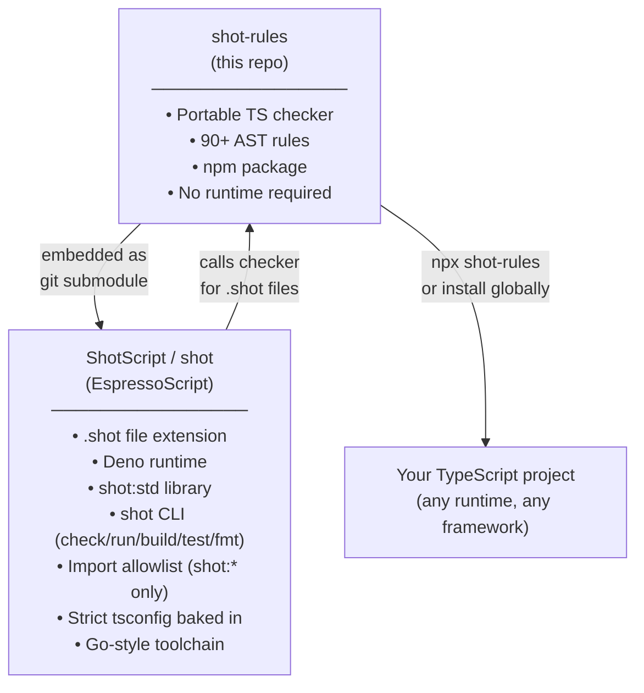

# shot-rules

Opinionated TypeScript linting rules extracted from [ShotScript](https://github.com/didley/EspressoScript). Apply Go-style discipline to any TypeScript project — no ShotScript dependency, no Deno runtime required.

```
shot-rules 'src/**/*.ts'

src/auth.ts:12:5: [no-arrow-functions] Arrow functions are not allowed.
src/auth.ts:34:3: [no-throw] throw statements are not allowed — return [null, error] instead.
src/types.ts:8:5: [require-readonly-property] Object type properties must be readonly.

3 violations found.
```

## What it enforces

The full set of rules from ShotScript's checker, adapted for any TypeScript codebase:

| Category | Rules |
|---|---|
| Functions | `no-arrow-functions`, `require-named-functions`, `require-explicit-return-type` |
| Variables | `no-var`, `no-let-outside-for`, `no-increment-decrement`, `no-unary-plus` |
| Error handling | `no-throw`, `no-try`, `no-promise-chain`, `require-tuple-destructure`, `require-async-tuple-return` |
| Types | `no-any`, `no-assertion`, `no-non-null`, `no-ts-comment`, `no-interface`, `no-enum`, `no-undefined-type` |
| Immutability | `require-readonly-property`, `require-readonly-arrays`, `no-readonly-wrapper` |
| Type safety | `no-optional-property`, `no-optional-parameter`, `no-default-parameter`, `no-empty-object-type`, `no-object-type`, `no-function-type` |
| OOP/meta | `no-class`, `no-abstract`, `no-decorators`, `no-this`, `no-metaprogramming-globals` |
| Type complexity | `no-conditional-type`, `no-mapped-type`, `no-template-literal-type`, `no-infer`, `no-intersection-types` |
| Control flow | `no-ternary`, `no-do-while`, `no-for-in`, `no-labels`, `switch-no-fallthrough` |
| Operators | `no-bitwise`, `no-delete`, `no-in`, `no-comma-operator`, `no-eval`, `no-generators` |
| Discipline | `no-shadow`, `no-multi-var-decl`, `no-param-reassign`, `no-multi-assign`, `no-return-assign` |
| Hygiene | `no-empty`, `no-lone-blocks`, `no-loop-func`, `no-self-compare`, `prefer-template` |
| Globals | `no-throwing-globals` (`JSON.parse`, `JSON.stringify`, `fetch` throw — wrap them) |
| Imports | `no-require`, `no-default-export`, `no-index-import` |
| Canonical forms | `no-array-generic`, `no-banned-utility-types`, `no-primitive-wrapper-types`, `no-index-signature` |

See [ShotScript's language docs](https://github.com/didley/EspressoScript/blob/main/docs/LANGUAGE.md) for the rationale behind each rule with before/after examples.

## How it relates to ShotScript



**shot-rules** is the rule engine. **ShotScript** is a complete opinionated language built on top of it — adding the `shot:` import system, the `shot:std` standard library, Deno as the runtime, and a locked-down CLI that removes all configurability. If you want the full ShotScript experience you use `shot`. If you want the rules applied to your existing TS project on your own terms, you use `shot-rules`.

## Install

**Global (run anywhere):**
```sh
npm install -g shot-rules
shot-rules 'src/**/*.ts'
```

**Per-project:**
```sh
npm install --save-dev shot-rules
npx shot-rules 'src/**/*.ts'
```

**One-off (no install):**
```sh
npx shot-rules 'src/**/*.ts'
```

## Usage

```sh
# Check all TypeScript files under src/
shot-rules 'src/**/*.ts'

# Check specific files
shot-rules src/index.ts src/lib.ts

# JSON output (for editor integration or CI tooling)
shot-rules --json 'src/**/*.ts'
```

Exit code `0` means no violations. Exit code `1` means violations were found or an error occurred.

### JSON output format

```json
[
  {
    "file": "src/auth.ts",
    "line": 12,
    "col": 5,
    "rule": "no-arrow-functions",
    "message": "Arrow functions are not allowed."
  }
]
```

## Strict tsconfig

`shot-rules` also ships a `tsconfig/shot-rules.json` you can extend to get the same strict compiler options ShotScript enforces:

```json
{
  "extends": "shot-rules/tsconfig/shot-rules.json",
  "compilerOptions": {
    "outDir": "./dist"
  }
}
```

This enables everything above `strict: true`: `noUncheckedIndexedAccess`, `exactOptionalPropertyTypes`, `noImplicitReturns`, `verbatimModuleSyntax`, and more.

## Integrating with your project

### package.json script

```json
{
  "scripts": {
    "lint": "shot-rules 'src/**/*.ts'"
  }
}
```

### Pre-commit hook (lefthook)

```yaml
# lefthook.yml
pre-commit:
  commands:
    shot-rules:
      glob: "*.ts"
      run: npx shot-rules {staged_files}
```

### Pre-commit hook (husky)

```sh
npx husky add .husky/pre-commit "npx shot-rules 'src/**/*.ts'"
```

### VS Code problem matcher

Add to `.vscode/tasks.json`:
```json
{
  "version": "2.0.0",
  "tasks": [
    {
      "label": "shot-rules",
      "type": "shell",
      "command": "npx shot-rules 'src/**/*.ts'",
      "problemMatcher": {
        "owner": "shot-rules",
        "fileLocation": ["relative", "${workspaceFolder}"],
        "pattern": {
          "regexp": "^(.+):(\\d+):(\\d+): \\[(.+)\\] (.+)$",
          "file": 1,
          "line": 2,
          "column": 3,
          "code": 4,
          "message": 5
        }
      },
      "group": "build"
    }
  ]
}
```

### Neovim (null-ls / none-ls)

```lua
local null_ls = require("null-ls")
null_ls.setup({
  sources = {
    null_ls.builtins.diagnostics.shot_rules.with({
      command = "shot-rules",
      args = { "--json", "$FILENAME" },
      on_output = require("null-ls.helpers").diagnostics.from_json({
        attributes = { row = "line", col = "col", code = "rule", message = "message" },
        severities = { default = null_ls.methods.DIAGNOSTICS.WARN },
      }),
    }),
  },
})
```

## Runtime utils

`shot-rules` ships a companion utility module for the globals its rules ban. Import from `shot-rules/utils`:

```ts
import { tryCatch, tryCatchAsync, jsonParse, jsonStringify, safeFetch } from "shot-rules/utils"
```

Every function returns `[value, null] | [null, Error]` — never throws.

### `tryCatch<T>(fn: () => T): Result<T>`

Wraps any synchronous call that might throw. Use this for third-party library calls.

```ts
const [data, err] = tryCatch(() => someLib.parse(input))
if (err !== null) { return [null, err] }
```

### `tryCatchAsync<T>(fn: () => Promise<T>): Promise<Result<T>>`

Same for async calls.

```ts
const [user, err] = await tryCatchAsync(() => db.findUser(id))
if (err !== null) { return [null, err] }
```

### `jsonParse<T>(text: string): Result<T>`

Safe replacement for the banned `JSON.parse`.

```ts
const [data, err] = jsonParse<Config>(rawText)
if (err !== null) { return [null, new Error(`invalid config: ${err.message}`)] }
```

### `jsonStringify(value: unknown, indent?: number | null): Result<string>`

Safe replacement for the banned `JSON.stringify`.

```ts
const [json, err] = jsonStringify(payload)
if (err !== null) { return [null, err] }
```

### `safeFetch(url: string | URL, init?: RequestInit | null): Promise<Result<Response>>`

Safe replacement for the banned `fetch`. Network errors surface as `Error`. HTTP error status codes are not automatically errors — check `res.ok` yourself.

```ts
const [res, fetchErr] = await safeFetch(`https://api.example.com/users/${id}`)
if (fetchErr !== null) { return [null, fetchErr] }
if (!res.ok) { return [null, new Error(`HTTP ${res.status.toString()}`)] }
const [data, parseErr] = jsonParse<User>(await res.text())
if (parseErr !== null) { return [null, parseErr] }
```

### `Result<T>` type

```ts
type Result<T> = [T, null] | [null, Error]
```

Re-export this from your own codebase to type all your fallible functions consistently.

## What's not included

Two rules from ShotScript are intentionally omitted from `shot-rules` as they are Shot-ecosystem specific:

- **`imports-allowlist`** — ShotScript restricts imports to `shot:*` and `jsr:@shotscript/*`. This is not portable; use your bundler or a custom lint rule for import restrictions in your project.
- **Deno-specific globals** in `no-throwing-globals` — `Deno.readTextFile` / `Deno.writeTextFile` bans are omitted. The rule still covers `JSON.parse`, `JSON.stringify`, and `fetch`.

## Development

```sh
git clone https://github.com/didley/shot-rules
cd shot-rules
npm install
npm run build
npm test
```

## License

MIT
