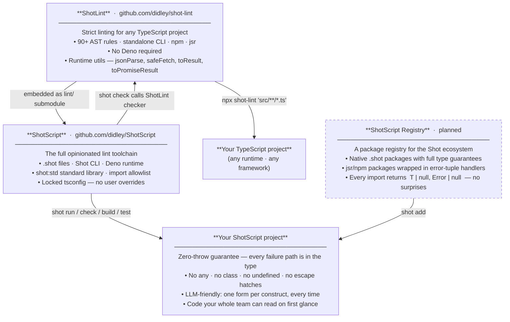

```
 ███████╗██╗  ██╗ ██████╗ ████████╗
 ██╔════╝██║  ██║██╔═══██╗╚══██╔══╝
 ███████╗███████║██║   ██║   ██║   
 ╚════██║██╔══██║██║   ██║   ██║   
 ███████║██║  ██║╚██████╔╝   ██║   
 ╚══════╝╚═╝  ╚═╝ ╚═════╝    ╚═╝   
 TypeScript, one way.
```
Shot extracts features from TypeScript, applying Go's "one canonical way" philosophy to the TS/JS ecosystem.
Making coding easier for humans and LLMs.

--

Echosystem:

**[ShotScript](https://github.com/didley/ShotScript)** — Opinionated toolchain strictly enforcing Shots principles.

**[ShotLint](https://github.com/didley/ShotLint)** — Utils and config for typing, linting, and formatting with Shots principles.

# ShotLint

This Package:

| | |
|---|---|
| **Rules** | 90+ AST rules enforced by a standalone CLI — no ESLint, no Biome, no framework lock-in |
| **Utils** | Safe replacements for every banned global (`jsonParse`, `safeFetch`, `tryCatch`, …) |
| **`AGENTS.md`** | Drop-in context file so AI coding assistants generate compliant code from the start |

---

## Install

**npm** · [npmjs.com/package/shot-lint](https://www.npmjs.com/package/shot-lint)
```sh
npx shot-lint 'src/**/*.ts'          # one-off, no install
npm install --save-dev shot-lint     # per-project
```

**jsr** · [jsr.io/@shot/lint](https://jsr.io/@shot/lint)
```sh
deno add jsr:@shot/lint
```

Add to `package.json`:
```json
{ "scripts": { "lint": "shot-lint 'src/**/*.ts'" } }
```

Extend the strict tsconfig:
```json
{ "extends": "shot-lint/tsconfig/shot-lint.json" }
```

---

```sh
npx shot-lint 'src/**/*.ts'

src/auth.ts:12:5:  [no-arrow-functions]        Arrow functions are not allowed.
src/auth.ts:34:3:  [no-throw]                  throw is not allowed — return [null, error] instead.
src/types.ts:8:5:  [require-readonly-property]  Object type properties must be readonly.

3 violations found.
```

## What changes

**Errors as values — failure is in the return type**
```ts
// ❌ before — caller can't see this throws; nothing in the type says so
async function getUser(id: number): Promise<User> {
    const res = await fetch(`/users/${id}`)
    return res.json() as User
}

// ✅ after — every failure path is explicit; the compiler tracks it
async function getUser(id: number): Promise<[User | null, Error | null]> {
    const [res, fetchErr] = await safeFetch(`/users/${id}`)
    if (fetchErr !== null) { return [null, fetchErr] }
    return jsonParse<User>(await res.text())
}
```

**`null` only — no `undefined`**
```ts
// ❌ before — three ways to say "nothing": undefined, ?, | undefined
type User = { id: number; avatar?: string; deletedAt?: Date }
function findUser(id?: number): User | undefined { ... }

// ✅ after — one absence value, used consistently everywhere
type User = { readonly id: number; readonly avatar: string | null; readonly deletedAt: Date | null }
function findUser(id: number): [User | null, Error | null] { ... }
```

**No complex types — compose, don't extend**
```ts
// ❌ before — intersection to "extend" a base type
type User = { readonly id: number; readonly name: string }
type AdminUser = User & { readonly role: 'admin' }

// ✅ after — embed as a named field (Go/Rust-style composition)
type User = { readonly id: number; readonly name: string }
type AdminUser = { readonly user: User; readonly role: 'admin' }

// access: admin.user.id  not  admin.id
```

**Immutable by default**
```ts
// ❌ before — any function can mutate these; nothing in the type stops it
type Config = { host: string; port: number }
const ids: number[] = []

// ✅ after — readonly at the type level; the compiler enforces it
type Config = { readonly host: string; readonly port: number }
const ids: ReadonlyArray<number> = []
```

**No escape hatches**
```ts
// ❌ before — type safety is optional; any and as let you opt out silently
function parseConfig(raw: any): Config { return raw as Config }
const el = document.getElementById('app')!

// ✅ after — unknown at boundaries; no casting, no non-null assertions
function parseConfig(raw: unknown): [Config | null, Error | null] { ... }
const el = document.getElementById('app')
if (el === null) { return [null, new Error('missing #app')] }
```

## Rules

| Category | Highlights |
|---|---|
| Functions | `no-arrow-functions` `require-named-functions` `require-explicit-return-type` |
| Variables | `no-var` `no-let-outside-for` `no-increment-decrement` |
| Error handling | `no-throw` `no-try` `no-promise` `no-promise-chain` `require-tuple-destructure` |
| Types | `no-any` `no-assertion` `no-non-null` `no-ts-comment` `no-interface` `no-enum` |
| Immutability | `require-readonly-property` `require-readonly-arrays` |
| Type shape | `no-optional-property` `no-optional-parameter` `no-undefined-type` |
| OOP / meta | `no-class` `no-abstract` `no-decorators` `no-this` `no-metaprogramming-globals` |
| Type complexity | `no-conditional-type` `no-mapped-type` `no-infer` `no-intersection-types` |
| Control flow | `no-ternary` `no-do-while` `no-for-in` `switch-no-fallthrough` |
| Operators | `no-bitwise` `no-eval` `no-generators` `no-comma-operator` |
| Lint | `no-shadow` `no-param-reassign` `no-multi-var-decl` |
| Hygiene | `no-empty` `no-loop-func` `no-self-compare` `prefer-template` |
| Globals | `no-throwing-globals` — bans `JSON.parse`, `JSON.stringify`, `fetch` |
| Imports | `no-require` `no-default-export` `no-index-import` |
| Canonical forms | `no-array-generic` `no-banned-utility-types` `no-primitive-wrapper-types` |

Full rationale and before/after examples for every rule: [`docs/LANGUAGE.md`](https://github.com/didley/ShotScript/blob/main/docs/LANGUAGE.md).

Flags: `--json` for machine-readable output. Exit `0` = clean, `1` = violations.

## Strict tsconfig

Ships a `tsconfig/shot-lint.json` with everything above `strict: true` — `noUncheckedIndexedAccess`, `exactOptionalPropertyTypes`, `verbatimModuleSyntax`, and more.

## Runtime utils

The rules ban `JSON.parse`, `JSON.stringify`, and `fetch` because they throw. `shot-lint/utils` provides the safe replacements — all return `[value, null] | [null, Error]`.

```ts
import { toResult, toPromiseResult, jsonParse, jsonStringify, safeFetch } from "shot-lint/utils"

// third-party calls that might throw or reject
const [val, err] = toResult(() => someLib.parse(input))
const [val, err] = await toPromiseResult(() => db.query(sql))

// banned globals → safe wrappers
const [data, err]  = jsonParse<Config>(text)
const [json, err]  = jsonStringify(payload)
const [res, err]   = await safeFetch("https://api.example.com/users/1")
```

`Result<T>` and `PromiseResult<T>` are exported for typing your own fallible functions:
```ts
import type { Result, PromiseResult } from "shot-lint/utils"

function divide(a: number, b: number): Result<number> {
    if (b === 0) { return [null, new Error("division by zero")] }
    return [a / b, null]
}

async function fetchUser(id: number): PromiseResult<User> {
    const [res, err] = await safeFetch(`/users/${id.toString()}`)
    if (err !== null) { return [null, err] }
    return jsonParse<User>(await res.text())
}
```

## Examples

Working projects in [`examples/`](./examples/):

| | |
|---|---|
| [`hello-world`](./examples/hello-world/) | Minimal setup |
| [`fetch-user`](./examples/fetch-user/) | `safeFetch` + `jsonParse` error chain |
| [`calculator`](./examples/calculator/) | `Result<T>` tuple returns |

## Ecosystem



## Development

```sh
git clone https://github.com/didley/shot-lint
cd shot-lint && npm install
npm run build && npm test
```

## License

MIT
