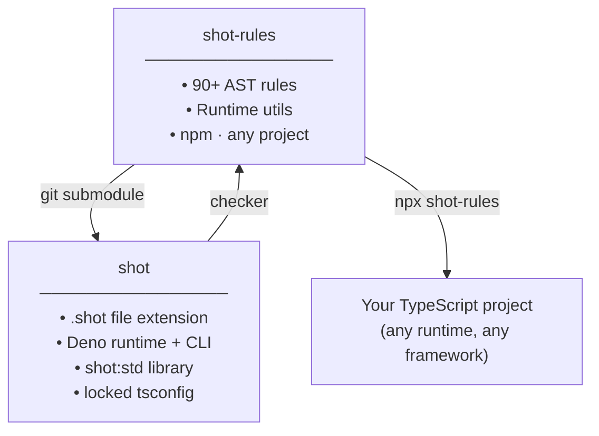

```
 ███████╗██╗  ██╗ ██████╗ ████████╗
 ██╔════╝██║  ██║██╔═══██╗╚══██╔══╝
 ███████╗███████║██║   ██║   ██║
 ╚════██║██╔══██║██║   ██║   ██║
 ███████║██║  ██║╚██████╔╝   ██║
 ╚══════╝╚═╝  ╚═╝ ╚═════╝    ╚═╝
 rules — Go-style discipline for any TypeScript project.
```

TypeScript has four ways to write a function, three ways to handle errors, and two ways to declare a type — and most codebases use all of them. `shot-rules` picks one of each and bans the rest.

90+ AST rules. Standalone CLI. Works with any runtime, any framework, no framework at all.

```sh
npx shot-rules 'src/**/*.ts'

src/auth.ts:12:5:  [no-arrow-functions]        Arrow functions are not allowed.
src/auth.ts:34:3:  [no-throw]                  throw is not allowed — return [null, error] instead.
src/types.ts:8:5:  [require-readonly-property]  Object type properties must be readonly.

3 violations found.
```

## What changes

**One way to write a function**
```ts
// ❌ before
const double = (n: number) => n * 2
[1,2,3].map(x => x * 2)

// ✅ after
function double(n: number): number { return n * 2 }
[1,2,3].map(function double(n: number): number { return n * 2 })
```

**Errors in the type signature, not the air**
```ts
// ❌ before
async function getUser(id: number): Promise<User> {
    const res = await fetch(`/users/${id}`)
    return res.json() as User  // throws, casts, lies
}

// ✅ after
async function getUser(id: number): Promise<[User | null, Error | null]> {
    const [res, fetchErr] = await safeFetch(`/users/${id}`)
    if (fetchErr !== null) { return [null, fetchErr] }
    return jsonParse<User>(await res.text())
}
```

**Types that mean what they say**
```ts
// ❌ before
type Config = { host: string; port?: number }
function load(input: any): Config { return input as Config }

// ✅ after
type Config = { readonly host: string; readonly port: number | null }
function load(input: unknown): [Config | null, Error | null] { ... }
```

## Rules

| Category | Highlights |
|---|---|
| Functions | `no-arrow-functions` `require-named-functions` `require-explicit-return-type` |
| Variables | `no-var` `no-let-outside-for` `no-increment-decrement` |
| Error handling | `no-throw` `no-try` `no-promise-chain` `require-tuple-destructure` |
| Types | `no-any` `no-assertion` `no-non-null` `no-ts-comment` `no-interface` `no-enum` |
| Immutability | `require-readonly-property` `require-readonly-arrays` |
| Type shape | `no-optional-property` `no-optional-parameter` `no-undefined-type` |
| OOP / meta | `no-class` `no-abstract` `no-decorators` `no-this` `no-metaprogramming-globals` |
| Type complexity | `no-conditional-type` `no-mapped-type` `no-infer` `no-intersection-types` |
| Control flow | `no-ternary` `no-do-while` `no-for-in` `switch-no-fallthrough` |
| Operators | `no-bitwise` `no-eval` `no-generators` `no-comma-operator` |
| Discipline | `no-shadow` `no-param-reassign` `no-multi-var-decl` |
| Hygiene | `no-empty` `no-loop-func` `no-self-compare` `prefer-template` |
| Globals | `no-throwing-globals` — bans `JSON.parse`, `JSON.stringify`, `fetch` |
| Imports | `no-require` `no-default-export` `no-index-import` |
| Canonical forms | `no-array-generic` `no-banned-utility-types` `no-primitive-wrapper-types` |

Full rationale and before/after examples for every rule: [`docs/LANGUAGE.md`](https://github.com/didley/EspressoScript/blob/main/docs/LANGUAGE.md).

## Install

```sh
# one-off
npx shot-rules 'src/**/*.ts'

# per-project
npm install --save-dev shot-rules

# global
npm install -g shot-rules
```

Add to `package.json`:
```json
{ "scripts": { "lint": "shot-rules 'src/**/*.ts'" } }
```

Flags: `--json` for machine-readable output. Exit `0` = clean, `1` = violations.

## Strict tsconfig

Ships a `tsconfig/shot-rules.json` with everything above `strict: true` — `noUncheckedIndexedAccess`, `exactOptionalPropertyTypes`, `verbatimModuleSyntax`, and more.

```json
{ "extends": "shot-rules/tsconfig/shot-rules.json" }
```

## Runtime utils

The rules ban `JSON.parse`, `JSON.stringify`, and `fetch` because they throw. `shot-rules/utils` provides the safe replacements — all return `[value, null] | [null, Error]`.

```ts
import { tryCatch, tryCatchAsync, jsonParse, jsonStringify, safeFetch } from "shot-rules/utils"

// third-party calls that might throw
const [val, err] = tryCatch(() => someLib.parse(input))
const [val, err] = await tryCatchAsync(() => db.query(sql))

// banned globals → safe wrappers
const [data, err]  = jsonParse<Config>(text)
const [json, err]  = jsonStringify(payload)
const [res, err]   = await safeFetch("https://api.example.com/users/1")
```

`Result<T>` is exported too — use it to type your own fallible functions:
```ts
import type { Result } from "shot-rules/utils"

function divide(a: number, b: number): Result<number> {
    if (b === 0) { return [null, new Error("division by zero")] }
    return [a / b, null]
}
```

## Examples

Working projects in [`examples/`](./examples/):

| | |
|---|---|
| [`hello-world`](./examples/hello-world/) | Minimal setup |
| [`fetch-user`](./examples/fetch-user/) | `safeFetch` + `jsonParse` error chain |
| [`calculator`](./examples/calculator/) | `Result<T>` tuple returns |

## Ecosystem



**shot-rules** — discipline on your terms, in your project.  
**[shot](https://github.com/didley/EspressoScript)** — the full opinionated toolchain built on top of it.

## Development

```sh
git clone https://github.com/didley/shot-rules
cd shot-rules && npm install
npm run build && npm test
```

## License

MIT
